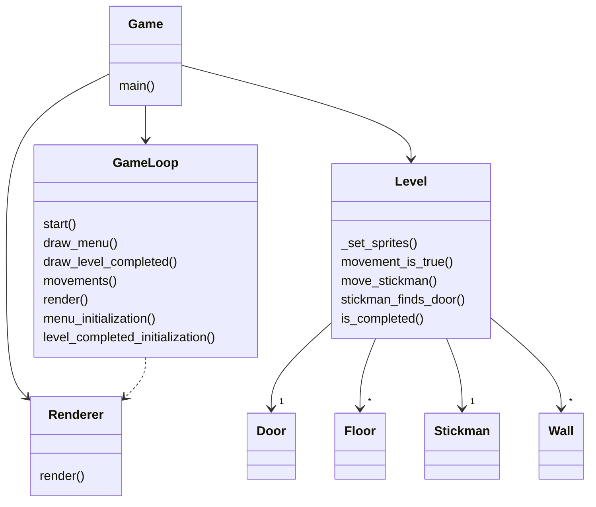
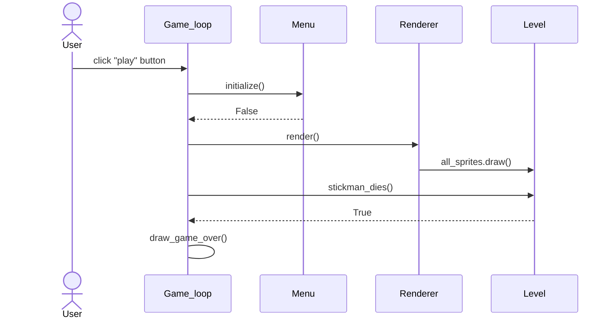

# Luokkakaavio

# Sekvenssikaavio

Tämä sekvenssikaavio kuvaa sitä tilannetta kun pelaaja aloittaa pelin painamalla "play" buttonia aloitusruudulla ja tämän jälkeen pelatessa häviää pelin osumalla monsteriin. Häviämisen seurauksena avautuu "game over" näkymä. 

Huom tämä sekvenssikaavio on yksinkertaistettu eikä kuvaa tarkempia tapahtumia pelihahmon liikuttamisesta ja monsteriin osumisesta pelin aikana!

