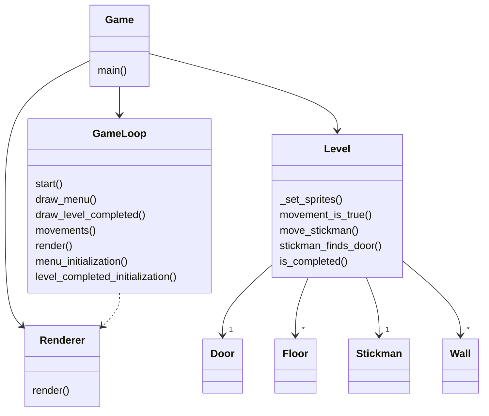

```mermaid
 classDiagram
	class Game{
  main()
	}
	class GameLoop{
  start()
  draw_menu()
  draw_level_completed()
  movements()
  render()
  menu_initialization()
  level_completed_initialization()
	}		
	class Renderer{
  render()
	}
	class Level{
  _set_sprites()
  movement_is_true()
  move_stickman()
  stickman_finds_door()
  is_completed()
	}
	class Door{
	}
	class Floor{
	}
	class Stickman{
	}
	class Wall{
	}
	Game --> Renderer
	Game --> GameLoop
	GameLoop ..> Renderer
	Game --> Level
	Level --> "1" Door
	Level --> "*" Floor
	Level --> "1" Stickman
	Level --> "*" Wall
```
