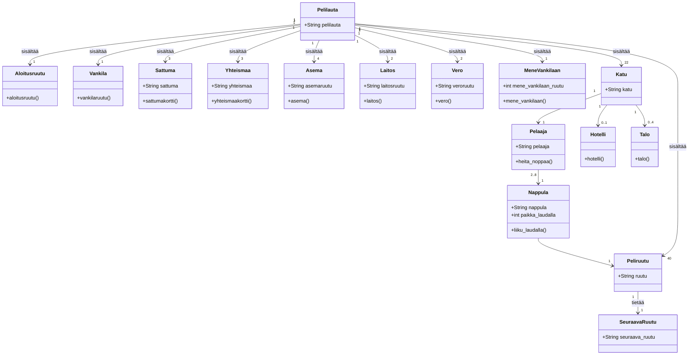

```mermaid
 classDiagram
	class Pelilauta{
		+String pelilauta
	}
	class Peliruutu{
		+String ruutu
	}		
	class SeuraavaRuutu{
		+String seuraava_ruutu
	}
	class Nappula{
		+String nappula
		+int paikka_laudalla
		+liiku_laudalla()
	}
	class Pelaaja{
		+String pelaaja
		+heita_noppaa()
	}
	class Aloitusruutu{
		+aloitusruutu()
	}
	class Vankila{
		+vankilaruutu()
	}
	class Sattuma{
		+String sattuma
		+sattumakortti()
	}
	class Yhteismaa{
		+String yhteismaa
		+yhteismaakortti()
	}
	class Asema{
		+String asemaruutu
		+asema()
	}
	class Laitos{
		+String laitosruutu
		+laitos()
	}
	class Vero{
		+String veroruutu
		+vero()
	}
	class MeneVankilaan{
		+int mene_vankilaan_ruutu
		+mene_vankilaan()
	}
	class Katu{
		+String katu
	}	
	class Hotelli{
		+hotelli()
	}
	class Talo{
		+talo()
	}		
	Pelaaja "2..8" --> "1" Nappula
	Nappula --> "1" Peliruutu
	Pelilauta "1" --> "40" Peliruutu :sisältää
	Peliruutu "1" --> "1" SeuraavaRuutu :tietää
	Pelilauta "1" --> "1" Aloitusruutu :sisältää
	Pelilauta "1" --> "1" Vankila :sisältää
	Pelilauta "1" --> "3" Sattuma :sisältää
	Pelilauta "1" --> "3" Yhteismaa :sisältää
	Pelilauta "1" --> "4" Asema :sisältää
	Pelilauta "1" --> "2" Laitos :sisältää
	Pelilauta "1" --> "2" Vero :sisältää
	Pelilauta "1" --> "1" MeneVankilaan :sisältää
	Pelilauta "1" --> "22" Katu :sisältää
	Katu "1" --> "1" Pelaaja
	Katu "1" --> "0..4" Talo
	Katu "1" --> "0..1" Hotelli
```

