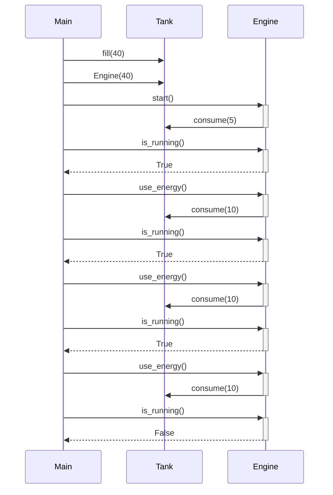

```mermaid	
 sequenceDiagram
	participant M as Main
	participant T as Tank
	participant E as Engine
	M->>T: fill(40)
	M->>T: Engine(40)
	M->>+E: start()
	E->>-T: consume(5)
	M->>+E: is_running()
	E-->>-M: True
	M->>+E: use_energy()
	E->>-T: consume(10)
	M->>+E: is_running()
	E-->>-M: True
	M->>+E: use_energy()
        E->>-T: consume(10)
        M->>+E: is_running()
        E-->>-M: True
	M->>+E: use_energy()
        E->>-T: consume(10)
        M->>+E: is_running()
        E-->>-M: False
```

		
	
	
